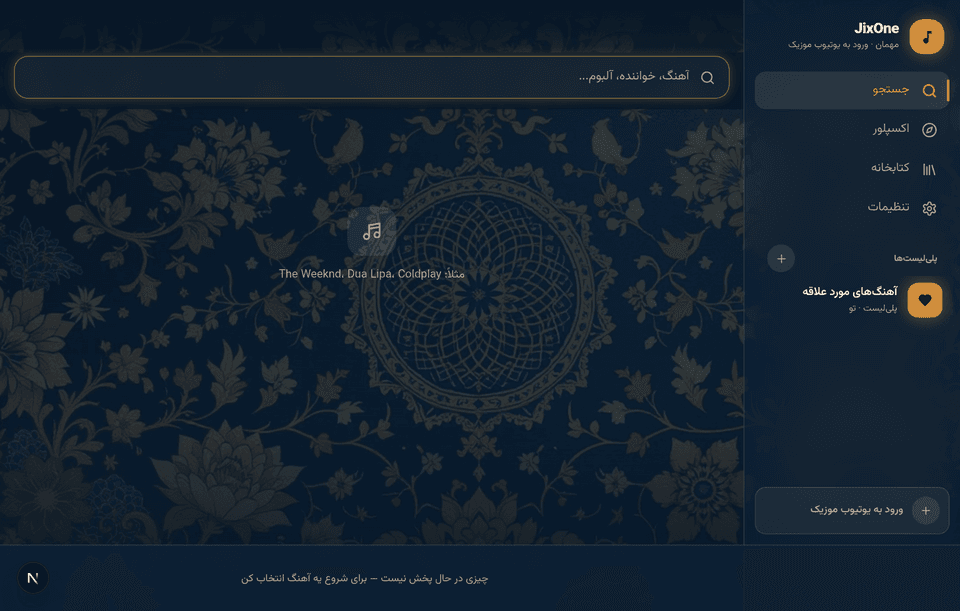
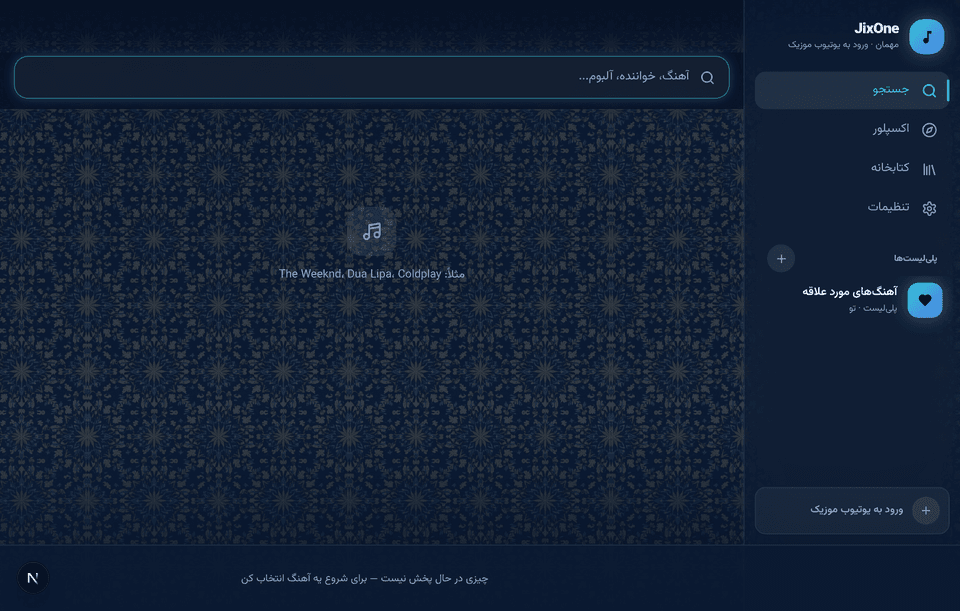
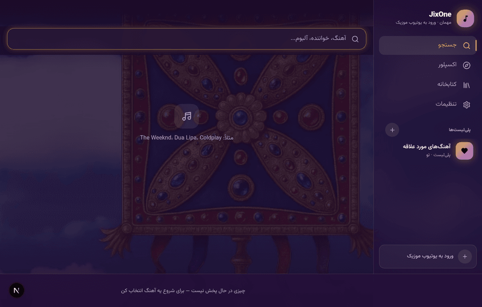
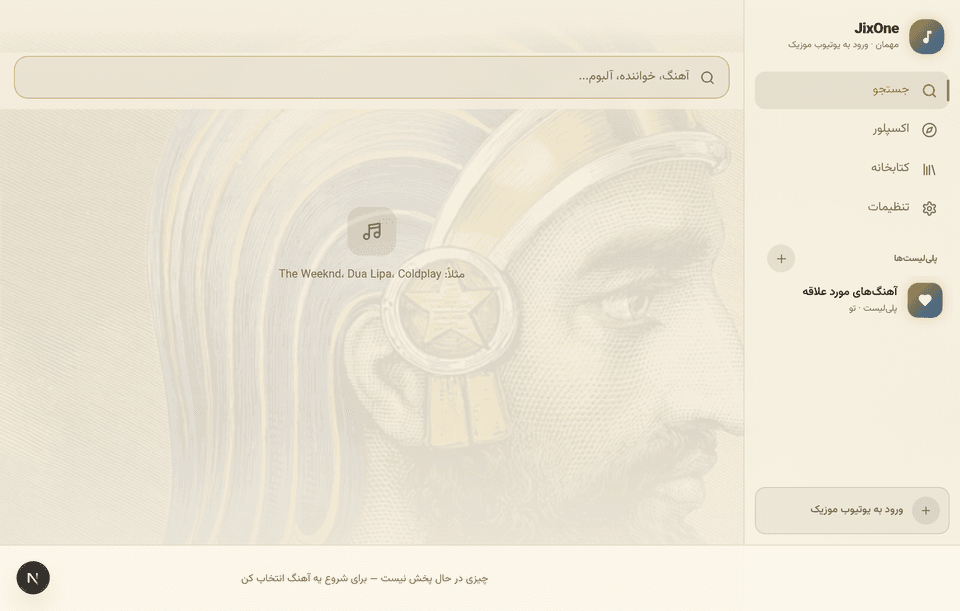

# JixOne

> A beautiful, ad-free music player for the YouTube Music catalog — a fully standalone Android app (web UI bundled inside the APK) plus a Next.js web app.
>
> پلیر موزیک زیبا و بدون تبلیغ برای کاتالوگ YouTube Music — اپ اندروید کاملاً مستقل (رابط وب داخل خود APK) + نسخه وب (Next.js).

**Current build: v1.2.0** · [download the APK](public/JixOne-v1.2.0.apk)

---

## Screenshots

| Home | Now playing |
| --- | --- |
|  |  |

| Settings | Mobile |
| --- | --- |
|  |  |

### The four Persian themes

| فرش ایرانی · Persian Carpet | کاشی اصفهان · Isfahan Tile |
| --- | --- |
|  |  |

| درفش کاویانی · Kaviani Banner | کوروش هخامنشی · Cyrus the Great |
| --- | --- |
|  |  |

---

## English

### Features

- **Full YouTube Music catalog** — search songs and artists and start listening instantly.
- **Ad-free playback engine** — audio streams are extracted directly on your device (raw innertube calls from Kotlin, the same approach as Metrolist). If extraction fails, the app falls back to the official YouTube player.
- **YouTube Music sign-in** — a real account session, which is what makes playback work at all on most tracks (see below).
- **Downloads & offline playback** — save songs to device storage (OPFS) at 160 / 70 / 50 kbps Opus, watch live progress in the download queue, and play them back with zero network.
- **Smart download queue** — sequential processing, retry on failure, automatic pause/resume when the network drops.
- **Library** — liked songs, listening history, and custom playlists (create, rename, delete, add/remove songs).
- **Queue panel** with shuffle and repeat (off / all / one), jump-to-track.
- **Video support** — switch between hidden / mini / theater video modes of the official player.
- **12 themes, 4 of them Persian** — Persian Carpet, Isfahan Tile, Kaviani Banner and Cyrus the Great each carry real artwork behind the whole app, veiled so text stays at full contrast. Plus Cyber Red, Cyber Blue, Synthwave, Spotify, OLED, Dubai, YT Light and YT Original.
- **Persian & English** — automatic RTL/LTR layout flip, Vazirmatn typography, locale-aware digits.
- **Professional animations** — staggered list entrances, player slide-in, panel transitions, theme cross-fade, and full `prefers-reduced-motion` support.
- **Standalone Android APK** — the whole web UI ships inside the app: install it and it just works, with **no server and no setup** (optional custom-server mode for power users in Settings).
- **Android extras** — MediaStyle lock-screen notification with play/pause/next/previous and a live seekbar, plus a resizable 4×1 home-screen widget that follows the app's accent color.

### Why sign-in matters

YouTube bot-gates anonymous innertube player calls. For most tracks an unauthenticated request comes back with:

```
playabilityStatus: LOGIN_REQUIRED — "Sign in to confirm you're not a bot"
```

No stream URL means no playback and no download, so signing in is not a nice-to-have — it is the difference between the app working and not working. A signed-in session lifts the gate, and it also unlocks the licensed song catalogue in search: an anonymous session is offered only Artists / Videos / Episodes / Playlists / Profiles filters, with no Songs or Albums at all.

**In the Android app:** Settings → Account → *Sign in to YouTube Music*. A WebView carries you through the normal Google login, and the session cookie is read from the CookieManager and stored on the device. Nothing is sent anywhere else — every innertube request simply carries that cookie plus the `SAPISIDHASH` authorization header Google's own clients send.

**On the web build:** browsers cannot read Google's cookies from another origin, so the server is configured instead. Put a cookie string copied from a signed-in `music.youtube.com` session into `YTM_COOKIE`:

```
YTM_COOKIE="SID=…; SAPISID=…; HSID=…"
```

Without it the web build still runs; it just hits the same gate on most tracks.

### How playback works

The device extracts audio stream URLs directly from YouTube's innertube API, from **your own IP** — no middleman server. The client chain is ANDROID_VR first (the one app client that still returns direct, un-ciphered URLs), then ANDROID_MUSIC, TVHTML5 and WEB_REMIX, each carrying a `visitorData` session id. Every candidate URL is byte-range probed before it reaches the player, so a locked or expired URL never becomes a silent failure.

Playback quality therefore depends on your network: datacenter IPs are gated hard, residential IPs and VPNs behave normally. YouTube Music also has to be available in your region — a VPN solves that too.

### Run the web app

```bash
npm install
npm run dev
# open http://localhost:3000
```

Production build:

```bash
npm run build && npm start
```

### Android app

The Android app is **fully standalone**: the entire web app is bundled inside the APK and served locally over a secure origin (`WebViewAssetLoader`), so search, playback, downloads and OPFS offline storage all run on the device. Install and play — no server URL is ever asked.

Rebuild everything (static web export → embed into assets → signed release APK) with one script:

```bash
./build-apk.sh
# result: download/JixOne-v1.2.0.apk
```

Requirements: Node.js, JDK 17+, Android SDK (platform 34 + build-tools 34), Gradle 8.7+.

- **Advanced:** Settings → *Custom server* lets a power user point the app at their own hosted JixOne web server instead of the bundled UI.
- Signing is pre-configured in `app/build.gradle.kts` and expects `android/jixone.keystore` (**not committed — keep a private backup**, it is required to sign future updates with the same identity). Without it, `gradle assembleDebug` still produces an installable APK, but its signature differs from release builds, so an installed release copy has to be uninstalled first.

### Tech stack

| Layer | Tools |
| --- | --- |
| Web | Next.js 16 (App Router), TypeScript, Tailwind CSS 4, shadcn/ui |
| State | Zustand (player / library / downloads / settings / view) |
| Extraction | Raw innertube (Kotlin on device, Node on the server) |
| Offline storage | OPFS (Origin Private File System) |
| Android | Kotlin WebView shell, MediaSessionCompat, RemoteViews widget |

### Disclaimer

JixOne is a client for publicly available YouTube content and hosts no media itself. Use it in accordance with YouTube's Terms of Service and your local copyright laws. This project is for personal, non-commercial use. The Persian theme artwork is third-party stock imagery — check its licence before distributing the app publicly.

---

## فارسی

### امکانات

- **دسترسی کامل به کاتالوگ YouTube Music** — جستجوی آهنگ و خواننده و پخش فوری.
- **موتور پخش بدون تبلیغ** — استریم صوتی مستقیماً روی دستگاه خودت استخراج می‌شود (درخواست خام innertube از Kotlin، همان روش Metrolist). اگر استخراج ناموفق باشد، برنامه به پلیر رسمی یوتیوب سوئیچ می‌کند.
- **ورود به یوتیوب موزیک** — یک نشست واقعی حساب کاربری؛ همان چیزی که اصلاً باعث می‌شود پخش روی بیشتر آهنگ‌ها کار کند (پایین‌تر توضیح داده شده).
- **دانلود و پخش آفلاین** — ذخیره آهنگ‌ها در حافظه دستگاه (OPFS) با کیفیت ۱۶۰ / ۷۰ / ۵۰ کیلوبیت Opus، نمایش زنده پیشرفت در صف دانلود، و پخش بدون اینترنت.
- **صف دانلود هوشمند** — پردازش ترتیبی، تلاش مجدد بعد از خطا، توقف/ادامه خودکار هنگام قطع اینترنت.
- **کتابخانه** — علاقه‌مندی‌ها، تاریخچه پخش و پلی‌لیست‌های شخصی (ساخت، تغییر نام، حذف، افزودن آهنگ).
- **صف پخش** با پخش تصادفی و تکرار (خاموش / همه / یکی).
- **پشتیبانی ویدیو** — حالت‌های مخفی / مینی / تئاتر برای ویدیوی رسمی.
- **۱۲ تم که ۴ تای آن ایرانی است** — فرش ایرانی، کاشی اصفهان، درفش کاویانی و کوروش هخامنشی هرکدام یک اثر هنری واقعی پشت کل برنامه دارند که زیر یک پرده می‌نشیند تا متن کنتراست کامل خود را نگه دارد. به‌علاوه کریمسون نئون، نئو توکیو، سینث‌ویو، اسپاتیفای، OLED، دبی، روشن یوتیوب و یوتیوب میوزیک.
- **فارسی و انگلیسی** — چرخش خودکار راست‌به‌چپ/چپ‌به‌راست، فونت وزیرمتن و اعداد هم‌ساز با زبان.
- **انیمیشن‌های حرفه‌ای** — ورود پله‌ای لیست‌ها، اسلاید پلیر، ترنزیشن پنل‌ها، کراس‌فید تم و پشتیبانی کامل از `prefers-reduced-motion`.
- **APK اندروید کاملاً مستقل** — کل رابط وب داخل خود اپ جاسازی شده: نصب کن و استفاده کن، **بدون هیچ سرور و تنظیماتی** (حالت «سرور دلخواه» برای کاربران حرفه‌ای در تنظیمات هست).
- **امکانات اندروید** — نوتیفیکیشن قفل‌صفحه با دکمه‌های پخش/توقف/بعدی/قبلی و نوار پیشرفت زنده، به‌همراه ویجت ۴×۱ قابل تغییر اندازه که رنگ اکسنت برنامه را دنبال می‌کند.

### چرا ورود به حساب مهم است؟

یوتیوب درخواست‌های ناشناس innertube را bot-gate می‌کند. برای بیشتر آهنگ‌ها، پاسخ یک درخواست بدون احراز هویت این است:

```
playabilityStatus: LOGIN_REQUIRED — «Sign in to confirm you're not a bot»
```

بدون آدرس استریم، نه پخشی هست نه دانلودی. پس ورود به حساب یک امکان جانبی نیست — مرز بین کارکردن و کارنکردن برنامه است. نشست لاگین‌شده این محدودیت را برمی‌دارد و کاتالوگ آهنگ‌های دارای لایسنس را هم در جستجو باز می‌کند: به نشست ناشناس فقط فیلترهای هنرمند / ویدیو / قسمت / پلی‌لیست / پروفایل داده می‌شود و اصلاً فیلتر «آهنگ» و «آلبوم» وجود ندارد.

**در اپ اندروید:** تنظیمات ← حساب کاربری ← *ورود به یوتیوب موزیک*. یک WebView تو را از مسیر عادی ورود گوگل عبور می‌دهد و کوکی نشست از CookieManager خوانده و روی همان دستگاه ذخیره می‌شود. هیچ چیزی جای دیگری فرستاده نمی‌شود — هر درخواست innertube فقط همان کوکی را به‌همراه هدر `SAPISIDHASH` که کلاینت‌های خود گوگل می‌فرستند حمل می‌کند.

**در نسخه وب:** مرورگر نمی‌تواند کوکی گوگل را از origin دیگری بخواند، پس به‌جایش سرور پیکربندی می‌شود. رشته‌ی کوکی را از یک نشست لاگین‌شده‌ی `music.youtube.com` کپی کن و در `YTM_COOKIE` بگذار:

```
YTM_COOKIE="SID=…; SAPISID=…; HSID=…"
```

بدون آن هم نسخه وب اجرا می‌شود؛ فقط روی بیشتر آهنگ‌ها به همان محدودیت می‌خورد.

### نحوه پخش چطور کار می‌کند؟

دستگاه آدرس استریم صوتی را مستقیماً از API اینرتیوب یوتیوب و با **IP خودت** استخراج می‌کند — بدون سرور واسط. زنجیره‌ی کلاینت‌ها اول ANDROID_VR است (تنها کلاینت اپی که هنوز آدرس مستقیم و بدون رمز برمی‌گرداند)، بعد ANDROID_MUSIC، TVHTML5 و WEB_REMIX، و همه یک شناسه‌ی نشست `visitorData` حمل می‌کنند. هر آدرس کاندید قبل از رسیدن به پلیر با یک درخواست بازه‌ای بایت آزموده می‌شود، تا آدرس قفل‌شده یا منقضی هیچ‌وقت به یک خطای بی‌صدا تبدیل نشود.

پس کیفیت پخش به شبکه‌ات بستگی دارد: IPهای دیتاسنتر سخت گیت می‌شوند، ولی اینترنت خانگی و VPN عادی کار می‌کنند. یوتیوب موزیک هم باید در منطقه‌ات در دسترس باشد — که VPN آن را هم حل می‌کند.

### اجرای نسخه وب

```bash
npm install
npm run dev
# باز کن http://localhost:3000
```

بیلد نهایی:

```bash
npm run build && npm start
```

### نسخه اندروید

اپ اندروید **کاملاً مستقل** است: کل اپ وب داخل APK جاسازی شده و از یک origin امن (`WebViewAssetLoader`) روی خود گوشی اجرا می‌شود — یعنی جستجو، پخش، دانلود و حافظه آفلاین OPFS همه روی دستگاه کاربرند. نصب کن و پخش کن — هیچ‌وقت آدرس سرور پرسیده نمی‌شود.

بیلد کامل (خروجی استاتیک وب ← جاسازی در assets ← APK امضاشده) با یک اسکریپت:

```bash
./build-apk.sh
# خروجی: download/JixOne-v1.2.0.apk
```

پیش‌نیازها: Node.js، JDK 17+، اندروید SDK (platform 34 + build-tools 34)، Gradle 8.7+.

- **پیشرفته:** تنظیمات ← *سرور اختصاصی* به کاربر حرفه‌ای اجازه می‌دهد اپ را به سرور وب شخصی خودش وصل کند.
- تنظیمات امضا در `app/build.gradle.kts` از قبل انجام شده و به `android/jixone.keystore` نیاز دارد (**در ریپو نیست — حتماً بکاپ خصوصی نگه دار**، برای امضای آپدیت‌های بعدی با همان هویت الزامی است). بدون آن، `gradle assembleDebug` هنوز یک APK قابل نصب می‌سازد، ولی امضایش با بیلدهای release فرق دارد، پس نسخه‌ی نصب‌شده‌ی release باید اول حذف شود.

### سلب مسئولیت

JixOne یک کلاینت برای محتوای عمومی یوتیوب است و خودش هیچ مدیایی را میزبانی نمی‌کند. لطفاً از آن مطابق قوانین یوتیوب و قوانین کپی‌رایت محل زندگی‌ات استفاده کن. این پروژه برای استفاده شخصی و غیرتجاری است. تصاویر تم‌های ایرانی از منابع استوک شخص ثالث هستند — پیش از انتشار عمومی برنامه، پروانه‌ی استفاده‌شان را بررسی کن.
