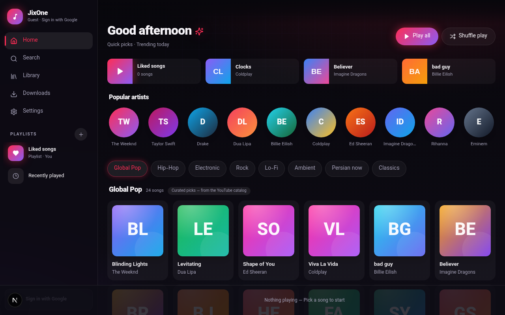
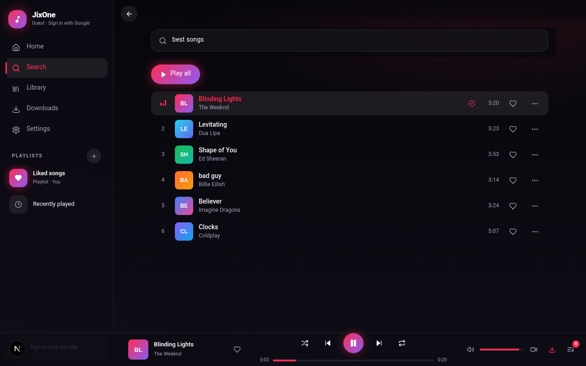
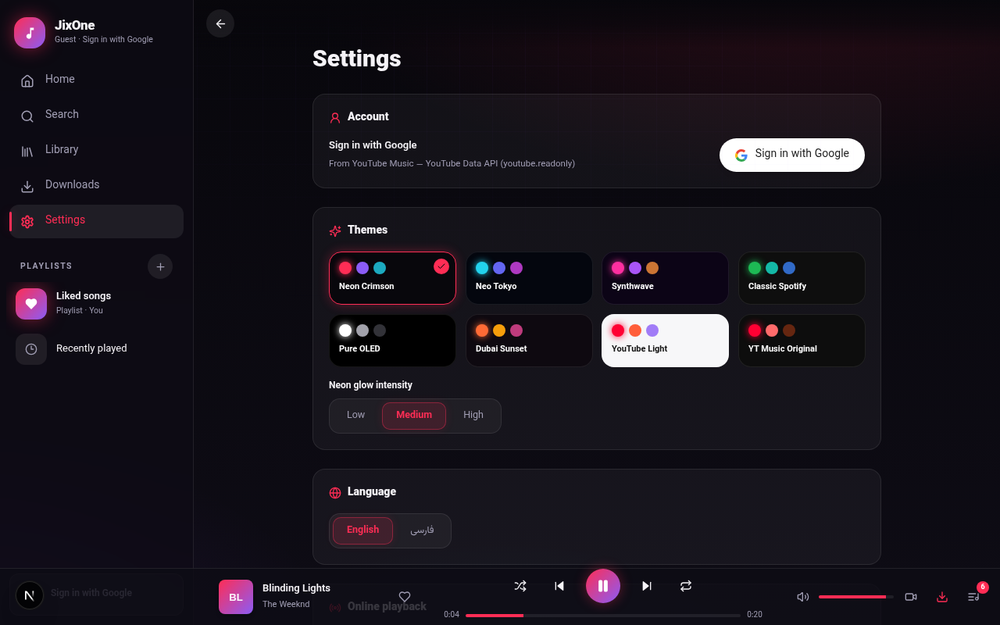
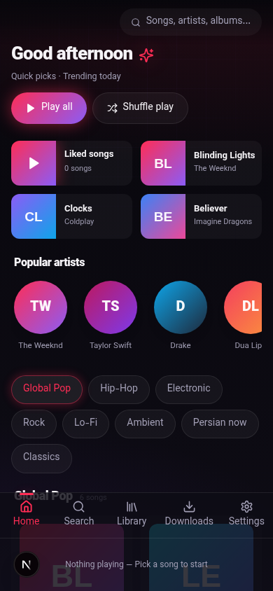

# JixOne

> A beautiful, ad-free music player for the YouTube Music catalog — Next.js web app + Android (WebView) app.
>
> پلیر موزیک زیبا و بدون تبلیغ برای کاتالوگ YouTube Music — نسخه وب (Next.js) + نسخه اندروید.

---

## Screenshots

| Home | Now Playing |
| --- | --- |
|  |  |

| Settings | Mobile |
| --- | --- |
|  |  |

---

## English

### Features

- **Full YouTube Music catalog** — search songs and artists and start listening instantly.
- **Ad-free playback engine** — audio streams are extracted directly on your device (youtubei.js in the browser, same trusted approach as Metrolist). If extraction fails, the app automatically falls back to the official YouTube player.
- **Downloads & offline playback** — save songs to device storage (OPFS) at 160 / 70 / 50 kbps Opus, watch live progress in the download queue, and play them back with zero network.
- **Smart download queue** — sequential processing, retry on failure, automatic pause/resume when the network drops.
- **Library** — liked songs, listening history, and custom playlists (create, rename, delete, add/remove songs).
- **Queue panel** with shuffle and repeat (off / all / one), drag-free reordering, jump-to-track.
- **Video support** — switch between hidden / mini / theater video modes of the official player.
- **8 hand-crafted multi-hue themes** — Cyber Red (default), Cyber Blue, Synthwave, Spotify, OLED, Dubai, YT Light, YT Original. Each theme is a full palette (surfaces, borders, text tiers, accent + glow), not just two colors.
- **Persian & English** — automatic RTL/LTR layout flip, Vazirmatn typography, locale-aware digits.
- **Google sign-in** — see your existing YouTube Music playlists inside the app (YouTube Data API v3). Runs in demo mode when no client ID is configured; guests can use everything else without an account.
- **Professional animations** — staggered list entrances, player slide-in, panel transitions, theme cross-fade, hover micro-interactions, and full `prefers-reduced-motion` support.
- **Android extras** — MediaStyle lock-screen notification with play/pause/next/previous and a live seekbar, plus a resizable 4×1 home-screen widget that follows the app's accent color.

### Tech stack

| Layer | Tools |
| --- | --- |
| Web | Next.js 16 (App Router), TypeScript, Tailwind CSS 4, shadcn/ui |
| State | Zustand (player / library / downloads / settings / view) |
| Extraction | youtubei.js (web bundle, runs client-side) |
| Offline storage | OPFS (Origin Private File System) |
| Android | Kotlin WebView shell, MediaSessionCompat, RemoteViews widget |

### Run the web app

```bash
npm install
npm run dev
# open http://localhost:3000
```

Production build:

```bash
npm run build && npm start
```

### Google sign-in (optional)

1. Create an OAuth 2.0 **Web** client ID in [Google Cloud Console](https://console.cloud.google.com/apis/credentials).
2. Add your deployment origin (e.g. `http://localhost:3000`) to **Authorized JavaScript origins**.
3. Put the client ID in `.env`:

```
NEXT_PUBLIC_GOOGLE_CLIENT_ID=your_client_id_here
```

Without a client ID the account section offers a demo sign-in so you can still try the playlist-import flow.

### Android app

1. Open the `android/` folder in Android Studio and run it on a device.
2. On first launch the app asks for your **server URL** — the address where the web app is hosted (local network or a deployed domain).
3. Signing is pre-configured in `app/build.gradle.kts` and expects `android/jixone.keystore` (**not committed — keep a private backup**, it is required to sign future updates).

### How playback works

The browser extracts audio streams directly from YouTube using its public web API, from **your own IP** — no middleman server, exactly like Metrolist. This means playback quality depends on your network: on datacenter/sandbox IPs YouTube may block extraction, while residential IPs and VPNs work normally.

### Disclaimer

JixOne is a client for publicly available YouTube content and hosts no media itself. Use it in accordance with YouTube's Terms of Service and your local copyright laws. This project is for personal, non-commercial use.

---

## فارسی

### امکانات

- **دسترسی کامل به کاتالوگ YouTube Music** — جستجوی آهنگ و خواننده و پخش فوری.
- **موتور پخش بدون تبلیغ** — استریم صوتی مستقیماً روی دستگاه خودت استخراج میشه (youtubei.js داخل مرورگر، همون روش مطمئن Metrolist). اگه استخراج ناموفق باشه، برنامه خودکار به پلیر رسمی یوتیوب سوئیچ می‌کنه.
- **دانلود و پخش آفلاین** — ذخیره آهنگ‌ها توی حافظه دستگاه (OPFS) با کیفیت ۱۶۰ / ۷۰ / ۵۰ کیلوبیت Opus، نمایش زنده پیشرفت توی صف دانلود، و پخش بدون اینترنت.
- **صف دانلود هوشمند** — پردازش ترتیبی، تلاش مجدد بعد از خطا، توقف/ادامه خودکار هنگام قطع اینترنت.
- **کتابخانه** — علاقه‌مندی‌ها، تاریخچه پخش و پلی‌لیست‌های شخصی (ساخت، تغییر نام، حذف، افزودن آهنگ).
- **صف پخش** با پخش تصادفی و تکرار (خاموش / همه / یکی).
- **پشتیبانی ویدیو** — حالت‌های مخفی / مینی / تئاتر برای ویدیوی رسمی.
- **۸ تم چندرنگ دست‌ساز** — Cyber Red (پیش‌فرض)، Cyber Blue، Synthwave، Spotify، OLED، Dubai، YT Light و YT Original. هر تم یک پالت کامل است (سطوح، بوردرها، لایه‌های متن، رنگ اکسنت و درخشش) — نه فقط دو رنگ.
- **فارسی و انگلیسی** — چرخش خودکار راست‌به‌چپ/چپ‌به‌راست، فونت وزیرمتن و اعداد هم‌ساز با زبان.
- **ورود با گوگل** — پلی‌لیست‌های قبلی‌ات در YouTube Music داخل برنامه نمایش داده میشن (YouTube Data API v3). بدون Client ID هم حالت دمو داره؛ مهمان‌ها بدون حساب از بقیه امکانات استفاده می‌کنن.
- **انیمیشن‌های حرفه‌ای** — ورود پله‌ای لیست‌ها، اسلاید پلیر، ترنزیشن پنل‌ها، کراس‌فید تم، میکرواینترکشن‌های hover و پشتیبانی کامل از `prefers-reduced-motion`.
- **امکانات اندروید** — نوتیفیکیشن قفل‌صفحه با دکمه‌های پخش/توقف/بعدی/قبلی و نوار پیشرفت زنده، به‌همراه ویجت ۴×۱ قابل تغییر اندازه که رنگ اکسنت برنامه رو دنبال می‌کنه.

### اجرای نسخه وب

```bash
npm install
npm run dev
# باز کن http://localhost:3000
```

بیلد نهایی:

```bash
npm run build && npm start
```

### ورود با گوگل (اختیاری)

1. توی [Google Cloud Console](https://console.cloud.google.com/apis/credentials) یک OAuth Client ID از نوع **Web** بساز.
2. آدرس سایتت (مثل `http://localhost:3000`) رو توی **Authorized JavaScript origins** اضافه کن.
3. شناسه رو توی فایل `.env` بذار:

```
NEXT_PUBLIC_GOOGLE_CLIENT_ID=شناسه_تو
```

اگه شناسه تنظیم نشده باشه، بخش حساب کاربری حالت دمو داره تا فرایند ورود پلی‌لیست‌ها رو امتحان کنی.

### نسخه اندروید

1. پوشه `android/` رو توی Android Studio باز کن و روی گوشی اجرا بگیر.
2. دفعه اول که برنامه باز بشه، **آدرس سرور** (همون آدرس سایت) رو ازت می‌پرسه — یا روی شبکه محلی یا دامنه‌ی دیپلوی‌شده.
3. تنظیمات امضا توی `app/build.gradle.kts` از قبل انجام شده و به فایل `android/jixone.keystore` نیاز داره (**توی ریپو نیست — ازش بکاپ خصوصی نگه دار**، برای امضای آپدیت‌های بعدی الزامیه).

### نحوه پخش چطور کار می‌کنه؟

مرورگر خودت استریم صوتی رو مستقیم و با **IP خودت** از API عمومی یوتیوب استخراج می‌کنه — بدون سرور واسط، دقیقاً مثل Metrolist. برای همین روی IPهای دیتاسنتر ممکنه یوتیوب جلوی استخراج رو بگیره، ولی با اینترنت خانگی یا VPN همه‌چیز عادی کار می‌کنه.

### سلب مسئولیت

JixOne یک کلاینت برای محتوای عمومی یوتیوب است و خودش هیچ مدیایی را میزبانی نمی‌کند. لطفاً از آن مطابق قوانین یوتیوب و قوانین کپی‌رایت محل زندگی‌ات استفاده کن. این پروژه برای استفاده شخصی و غیرتجاری است.
